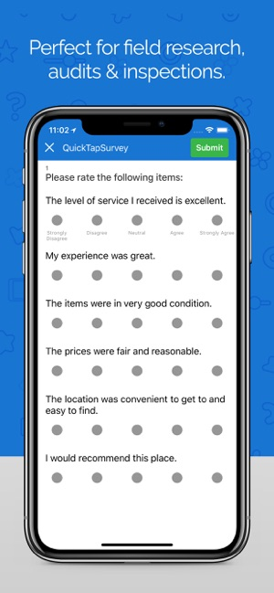

# Data Net

## Michael Buenaventura, Digital Humanities 150 - Winter 2020, Professor Cho

I want to contribute to the human-subjects research community with this project. Much of research on humans requires data collection via surveys and forms. Creating, distributing, and analyzing these instruments take up a significant amount of time in the research process. Making this process more efficient through app-based distrubition can save both researchers and participants valuable time and energy.

## [Fulcrum](web.fulcrumapp.com)
### Fulcrum is a data-collection app designed to be used by people who want to gather information via surveys and forms. From car inspection forms to customer satisfaction surveys, the app is meant to be applicable to a wide variety of industries. Users can create multiple surveys and track user responses. My analysis is strictly on the mobile-app version of Fulcrum.

### Overall, Fulcrum is a solid app, but it should be restructured in order to reach its full potential. It constantly provides users with useful status information and prevents users from performing unwanted tasks, such as saving an invalid survey entry. However, the experience could be improved, as the app's language, cluttered interface, flexibility, and support could all be improved.

## Heuristics Evaluation of Fulcrum

By  Michael Buenaventura	Date  1/10/ 2020

### 1. Visibility of system status 
*	Always keep users informed about what is going on.
*	Provide appropriate feedback within reasonable time. 

**Evaluation**

This app does a solid job of letting users know what the system is doing. System status information is displayed after actions that require significant processing. Such information will appear either in a thin banner on the top of the screen or a box in the middle of the screen. For example, if I want to synchronize my data, a thin bar will a appear at the top indicating the progress of synchronization. Quick actions, such as navigating to the settings page, do not show progress information as this would be unnecessary.
This app could be improved in this dimension if it gave notification about when surveys or entries are successfully added. When this occurs, the surveys or entries appear in the respective lists, but without notification. 

Severity rating: 1

### 2. Match between system and the real world 
*	Speak the users' language, with words, phrases and concepts familiar to the user, rather than system-oriented terms. 
*	Follow real-world conventions, making information appear in a natural and logical order. 

**Evaluation**

Most of the language is intuitive. For example, “sort” sorts entries in a certain way and “filter” allows the user to filter entries. However, surveys are labelled as “apps” which doesn’t make a lot of sense on the user-end. Additionally, it is not immediately clear what the action “synchronize” does.
In terms of order of information, the app is a little out of sorts. The app gives a nice summary of all surveys on the homepage. When viewing a summary of responses, the first thing that appears is a map of responses. This is counterintuitive as researchers would probably prefer a searchable list of all responses, which takes an extra step to get to.

Severity rating: 2

### 3. User control and freedom 
*	Users often choose system functions by mistake.
*	Provide a clearly marked "out" to leave an unwanted state without having to go through an extended dialogue. 
*	Support undo and redo. 

**Evaluation**

Users are able to exit out of unwanted situations. This is made possible with a cancel button placed in the upper left-hand corner. Users can also save unfinished survey entries as drafts. Users are prevented from saving entries that don’t fill out required fields and allow users to save these entries as drafts.
Severity rating: 1

### 4. Consistency and standards 
*	Users should not have to wonder whether different words, situations, or actions mean the same thing. 
*	Follow platform conventions. 

**Evaluation**

Again, the words “synchronize” and “app” can be confusing to users. It is not immediately apparent that “synchronize” means to match data up with the desktop version’s data and “app” means a data collection instrument. More significantly, there is a “map area” button that does not do anything. Navigating to the homepage is also very difficult, as there is no home icon. 

Severity rating: 3

### 5. Error prevention 
*	Even better than good error messages is a careful design which prevents a problem from occurring in the first place. 

**Evaluation**

Users are prevented from saving null survey entries which is a plus. However, users might have trouble finding surveys that match their needs. While the survey templates provided are searchable, they are around 50 of them. The user can easily get lost in testing many of the 50 surveys to find the best fit.

Severity rating: 2

### 6. Recognition rather than recall 
	Make objects, actions, and options visible. 
	User should not have to remember information from one part of the dialogue to another. 
	Instructions for use of the system should be visible or easily retrievable whenever appropriate. 

**Evaluation**

The app offers several survey templates such as a “Customer Satisfaction” survey and a “Incident Report Form”. Though these are not customizable in the mobile app, these templates allow users to choose surveys that are close to their needs. In fact, users cannot start surveys from scratch in the app.

Severity rating: 1

### 7. Flexibility and efficiency of use 
*	Accelerators -- unseen by the novice user -- may often speed up the interaction for the expert user so that the system can cater to both inexperienced and experienced users. 
*	Allow users to tailor frequent actions. 

**Evaluation**

The homepage is not editable and frequently-used surveys don’t seem to get priority in the homepage. Survey templates cannot be editing in-app according to users’ needs. Additionally, the app doesn’t tailor towards whatever industry the user might be in, though there seems to be an opportunity for this. Surveys cannot be duplicated either, which could be valuable to people distributing surveys to multiple arms of an experiment.

Severity rating: 3

### 8. Aesthetic and minimalist design 
*	Dialogues should not contain information which is irrelevant or rarely needed. 
*	Every extra unit of information in a dialogue competes with the relevant units of information and diminishes their relative visibility. 

**Evaluation**

There are words everywhere. The homepage is filled with long survey titles and descriptions. The settings are spread out over many buttons. Survey template titles and descriptions are too long for their designated spaces.

Severity rating: 3 

### 9. Help users recognize, diagnose, and recover from errors 
*	Expressed in plain language (no codes)
*	Precisely indicate the problem
*	Constructively suggest a solution. 

**Evaluation**

Again, users are prevented from saving incomplete surveys and are guided into saving them as drafts. 

Severity rating: 1

### 10. Help and documentation 

*	Even though it is better if the system can be used without documentation, it may be necessary to provide help and documentation. 
*	Help  information should be easy to search, focused on the user's task, list concrete steps to be carried out, and not be too large. 

**Evaluation**

There is no help nor FAQ’s page. There is a “contact support” button, but it leads to a browser page that is clearly not mobile-friendly.

Severity rating: 2

## [QuickTapSurvey](https://www.quicktapsurvey.com/)
### QuickTapSurvey is another data-collection app. It is more specifically designed for survey-collectors and the target audience is not as wide as Fulcrum's. Users can create surveys and analyze responses on the desktop website. From these surveys, users can administer the survey live in the mobile app. Again, my analysis is strictly on the mobile-app version.

### Overall, QuickTapSurvey is well put-together and only needs a few minor tweaks. It presents information in an intuitive and concise sense. It also provides adequate help and support. However, the app could be more customizable to fit frequent-users' needs. Adding features, such as the ability to create and edit survey instruments in-app could optimize the experience. 

## Heuristics Evaluation of QuickTapSurvey

By  Michael Buenaventura	Date  1/10/ 2020

### 1. Visibility of system status 
*	Always keep users informed about what is going on.
*	Provide appropriate feedback within reasonable time. 

**Evaluation**

A thin blue navigation bar at the top of the page lets users know where in the app they are. It is straightforward and functions well. When syncing, status info appears throughout the process as well. 

Severity rating: 1

### 2. Match between system and the real world 
*	Speak the users' language, with words, phrases and concepts familiar to the user, rather than system-oriented terms. 
*	Follow real-world conventions, making information appear in a natural and logical order. 

**Evaluation**

The language is intuitive. "Drafts", "Published", and "Submit" all map to expected areas and functions. The app is designed primarily for data-collection and users can set a participant up with a survey within one tap.

Severity rating: 1

### 3. User control and freedom 
*	Users often choose system functions by mistake.
*	Provide a clearly marked "out" to leave an unwanted state without having to go through an extended dialogue. 
*	Support undo and redo. 

**Evaluation**

Users can discard unfinished surveys and look at survey drafts. It takes a couple of taps to exit out of giving feedback, but it is certainly possible. Users cannot directly edit survey drafts in the mobile app, which would help extend user control.

Severity rating: 2

### 4. Consistency and standards 
*	Users should not have to wonder whether different words, situations, or actions mean the same thing. 
*	Follow platform conventions. 

**Evaluation**

Standard language is used throughout the app ("menu", "settings", etc.). There is no clear home menu, however, nor icon to navigate to/indicate it.

Severity rating: 2

### 5. Error prevention 
*	Even better than good error messages is a careful design which prevents a problem from occurring in the first place. 

**Evaluation**

Users are prevented from submitting surveys that do not have required fields filled out. Additonally, everytime a survey is submitted, the user is asked if they are sure they want to submit it, allowing for the opportunity to back out. However, a useless warning is given at the beginning of a survey formatted on a different platform, stating that the survey has been reformatted. The issue here is that the error message only has one option - "okay" - and users cannot back out of surveys at this point.

Severity rating: 2

### 6. Recognition rather than recall 
	Make objects, actions, and options visible. 
	User should not have to remember information from one part of the dialogue to another. 
	Instructions for use of the system should be visible or easily retrievable whenever appropriate. 

**Evaluation**

Users are able to either select templates or start from scratch. There are no visual representations to distinguish surveys from each other, other than words. A visual heuristic can prevent users from reading through all of their surveys to find the desired one.

Severity rating: 1

### 7. Flexibility and efficiency of use 
*	Accelerators -- unseen by the novice user -- may often speed up the interaction for the expert user so that the system can cater to both inexperienced and experienced users. 
*	Allow users to tailor frequent actions. 

**Evaluation**

Surveys are not sorted by frequency of use nor importance, which could help users find important surveys more quickly. The homepage cannot be manipulated such that certain surveys appear first. There are no customizable settings options.

Severity rating: 3

### 8. Aesthetic and minimalist design 
*	Dialogues should not contain information which is irrelevant or rarely needed. 
*	Every extra unit of information in a dialogue competes with the relevant units of information and diminishes their relative visibility. 

**Evaluation**

While the design is minimalistic, survey titles do not fit in their buttons. Additionally, while the survey items themselves are clearly designed for mobile devices, they are presented all at once. This can overwhelm participants.

Severity rating: 2

### 9. Help users recognize, diagnose, and recover from errors 
*	Expressed in plain language (no codes)
*	Precisely indicate the problem
*	Constructively suggest a solution. 

**Evaluation**

Users cannot submit surveys that do not have required fields filled out. The system suggests that users fill these out. Additionally, if the user has no surveys in the system, the app gives clear instructions for creating a survey online.

Severity rating: 1

### 10. Help and documentation 

*	Even though it is better if the system can be used without documentation, it may be necessary to provide help and documentation. 
*	Help  information should be easy to search, focused on the user's task, list concrete steps to be carried out, and not be too large. 

**Evaluation**

There is a help page with FAQ's and solutions presented in mobile-app form. Additonally, the page provides contact information for more help resources

Severity rating: 1
